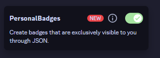
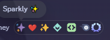

# PersonalBadges

> Create badges that are **exclusively** visible to you through JSON.





#### Want to install this plugin?
> https://docs.vencord.dev/installing/custom-plugins/

## Usage

Once the plugin is enabled, you should *immediately* have a directory created within your `%AppData%/Roaming/Vencord` folder named `badges` .

Navigate to this directory and to begin creating your first badge, you must create a `.json` file. The name does not matter, **but the contents do**.

### Badge Properties

| Property | Description | Required |
| --- | --- | --- |
| `image` | An **image link** that is set for the badge. I don't think the file type matters; feel free to use gifs, etc. | `false` |
| `tooltip` | The **tooltip / description** that appears when hovering over the badge. | `false` |
| `position` | The **badge position** of which can be either `START` or `END`. It is *case-insensitive*. | `false` |
| `link` | A **link** that is opened upon clicking the badge. If this is not set by default, it will link to this repository. :] | `false` |
| `users` | An array of **users** listed by **ID** that **will have** this badge. *No, they cannot see it.* | `true` **if global is not set.**|
| `global` | Whether or not the badge is **globally** visible. This just means it's added to everyone; *it will* override `users`. | `true` **if users is not set.** |
| `excluded` | An array of **users** listed by **ID**, that will **not have** this badge. *This will* override `global` and `users`. *Now, they really can't see it.* | `false` |

#### Example

**Remember** that some of these override each other, so it could be useless to keep them. I am just showcasing all of the properties in use at once, even though not all of them are needed.

##### `sparkly.json`
```json
[
    {
        "image": "https://i.imgur.com/ubPqge8.png",
        "tooltip": "Sparkly ✨",
        "position": "start",
        "link": "https://github.com/YLohkuhl/personalBadges",
        "users": ["USER_ID_HERE_THOUGH_IT_GETS_OVERRIDDEN_ANYWAYS"],
        "global": true,
        "excluded": ["USER_ID_IN_QUOTATION_MARKS_ONLY"]
    }
]
```

<sub>If you actually wanna use this badge, just remove `users`, `excluded`, `positions` and `link` *(unless you wanted any of these)*. Feel free to enjoy being ✨ Sparkly ✨ .</sub>

**It is important to have the `[]` as your start before `{}`**. This gives support for having multiple badges in one file in case you ever want to have less files.

If you want, *you could* share these files with other users who you'd like to see the same badge as you. Even something made to be private like this could still be public if you decide so!

✨ **Thank you for using my plugin if you decided to do so!** ✨

<sub>**Notice!** I may not have to mention this but you know... if you go haywire when adding a ton of badges to a user, might not look so good with the UI. That takes *a lot* of badges for that though... *maybe fix it with some CSS, idk*.</sub>

<sub><i>. . . This is my first plugin for Vencord-</i></sub>
