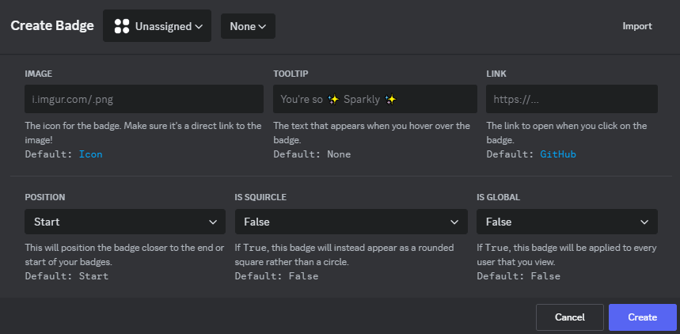
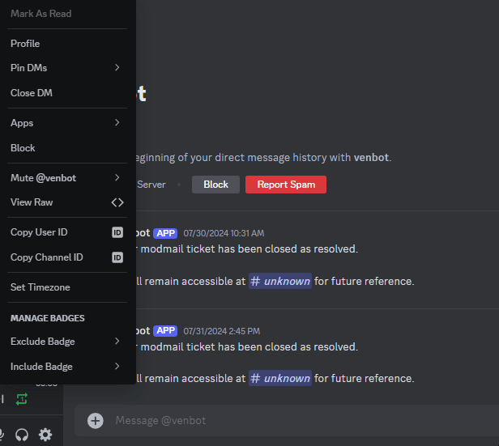
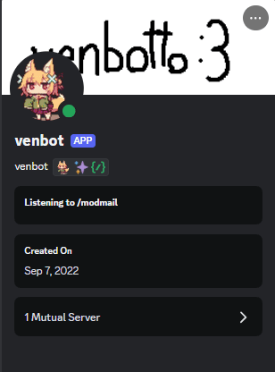
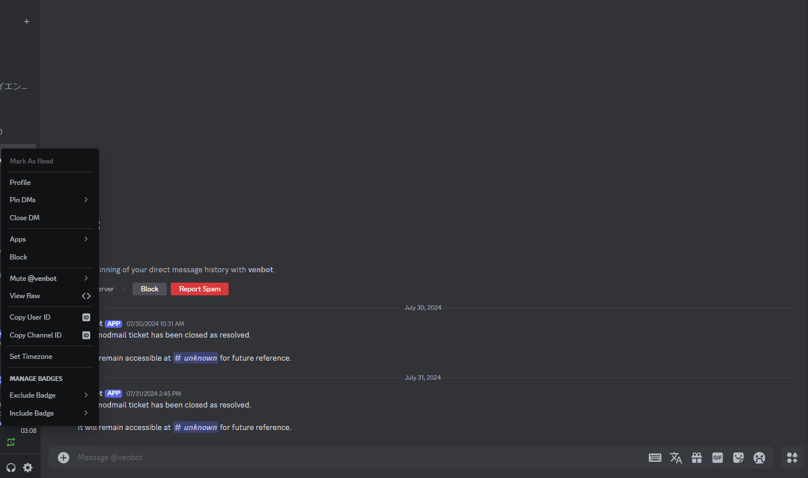
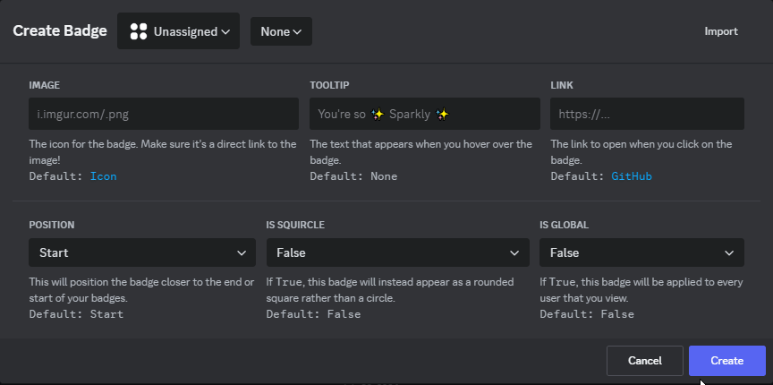

    <h1>
          
        Personal Badges
    </h1>
    <q>Create profile badges that are <b>exclusively</b> visible to you through locally stored data.</q>
     
    Developed by <a href="https://github.com/YLohkuhl">YLohkuhl</a>. Powered by <a href="https://github.com/Vendicated/Vencord">Vencord</a>.

    <h2>A look inside . . .</h2>
     
        
    
      
        
    
     

    <h3>Seems interesting? Want to install this plugin?</h3>
    <li>
        <a href="https://docs.vencord.dev/installing/custom-plugins/"><b>Installing Custom Vencord Plugins</b></a>
    </li>

    <a href="docs/BASIC_INSTRUCTIONS.md">
        <h3>Refer to here for a set of basic instructions on the plugin.</h3>
    </a>

