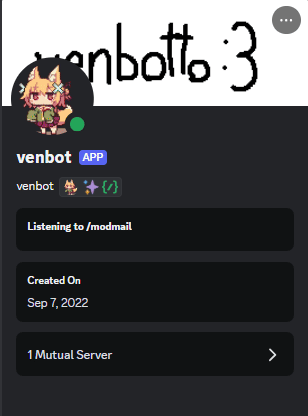

    <h1>Basic Instructions</h1>

The plugin has been developed with simplicity in mind. Everything is operated in-app with user-friendly UI in hope to making a nice and smooth usage for all users.

### Startup

After going to your plugins and enabling **Personal Badges**, click on the cog wheel for the plugin which should open the settings.

When opening your settings, you should see a set of buttons. I highly recommend enabling the `VencordToolbox` plugin to have ease of access to a few of these.

### Creating Badges

In your settings, click on the **"`Open Badge Modal`"**  button. This should open the primary modal for creating, modifying or even deleting badges.

The modal should be generally self-explanatory on what to do with it. The top select menus are for selecting categories / or badges in case that is confusing though.

If you do not have a category yet but would like to have one, scroll down past managing badges.

### Managing Badges

After creating a badge, there is a simple way for you to add them to **any user** you want or **any guild** *(guild = server)*.

**Right click** on the desired **user / or guild** you'd like to give the badge to and a context menu should pop out. Look for the buttons along the lines of **"`Manage Badges`"**.

There should be **two** menu items here, **`Exclude Badge`** & **`Include Badge`**.
Both of them are an identical copy of each other but with different actions. 

**Hover over them** to get a list of badges / or categories that could be managed for the desired user / or guild.

#### `Exclude Badge` 
Upon using **Exclude Badge** the badge will be excluded from the user.

This will **OVERRIDE `global`, `users` and `guilds`**. For instance, if a badge is set to be `global` and a user is excluded, they will not have the badge shown for them.

If a badge is excluded from a guild, it will **no longer appear for any users you view in that guild**.

#### `Include Badge`

Upon using **Include Badge** the badge will be included for the user. This is the complete opposite of `Exclude Badge`.

This doesn't really override anything, it will include a user who was **previously excluded**. `guilds` *(only when viewing a guild)*, `global` and `excluded` overrides including.

If a badge is included for a guild, it will **appear for any users you view in that guild**.

Do know that any badge which isn't assigned to a category is automatically considered unassigned and will be listed normally.

### Creating Categories

Using the same method to open the context menu for **managing badges**; **Right click** on any **user / or guild** for creating the category. It doesn't matter as all you need is to open the menu. 

<q>Why can't you open the modal separately?</q> well idk, just felt right?

Anyways, hover over either button under **"`Manage Badges`"**. Again, it doesn't matter. Afterwards, click on the **"`Create Category`"** button. 

**NOW** this is where the magic happens! This should open the primary modal for creating, modifying or even deleting a category.

Again, the modal should be generally self-explanatory on what to do with it.

Do know that the name of your category does have a <b>character limit of 20</b> so the input is shortened in size.

### Importing / Exporting

By now you should know that these buttons exists, where everything is located, etc.

If you haven't seen anything about `Export` yet, just know that you have to be editing something for that button to appear.

I am not going to give any instructions on this as it as is simple as saving / or opening a file after clicking a button though I will provide additional documentation on the data types *(only modifiable properties)*.

In case you're not sure what that is, you can skip this. **It's only** if you want to manually modify an exported file or create your own. You could even update older files from `V1` if you have any.

A good case for this would be if you have multiple badges in one file within an array. Convert this to a category! Can only import one badge at a time.

#### Badge Interface Properties
- [`IPersonalBadge`]()

#### Category Interface Properties
- [`IPBadgeCategory`]()